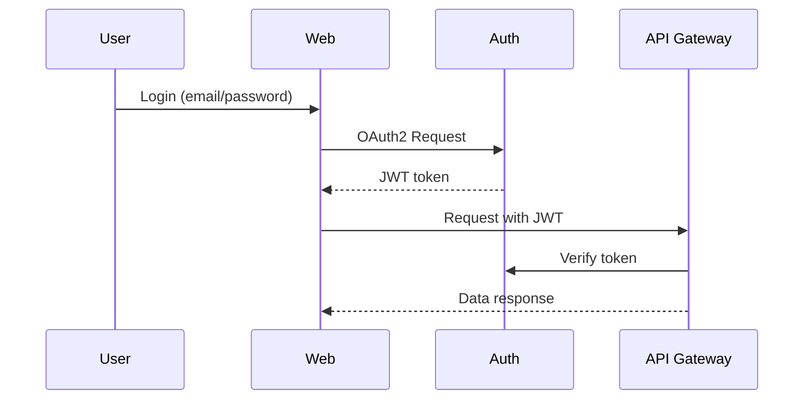

# FinTrust

**FinTrust** is a fictional fintech application built for [DevSecAI](https://github.com/DevSecAI-Champions)'s 6-month **Security Champions** training programme. This repo is intentionally scaffolded with deliberate security flaws for secure coding, IaC, and DevSecOps training—**do not use in production**.

Official repo: [github.com/DevSecAI-Champions/FinTrust](https://github.com/DevSecAI-Champions/FinTrust)

---

## Architecture overview

The diagram below shows the high-level architecture of the FinTrust application stack used throughout the Security Champions training programme.

```mermaid
graph TD
  User[User Browser]
  Web[Web Portal (React)]
  API[API Gateway (Node.js)]
  Auth[Auth Service (OAuth2)]
  DB[(PostgreSQL Database)]
  S3[[S3 Bucket]]
  FX[3rd Party: FX API]

  User --> Web
  Web -->|JWT| API
  API --> Auth
  API --> DB
  API --> S3
  API --> FX
```

- **Web** (React) — Port 3001: User-facing portal; contains deliberate XSS and missing security headers for training.
- **API** (Node.js/Express) — Port 4000: Backend API; contains missing auth checks, IDOR, and verbose error responses for training.
- **Auth** (Node.js) — Port 5001 locally (5000 in Docker; 5000 is often in use on macOS).

Auth flow (simplified):



See [docs/architecture.md](docs/architecture.md) and [docs/auth-flow.md](docs/auth-flow.md) for more detail.

---

## Run locally (without Docker)

**Option A — one command (recommended)**

```bash
npm run install:all    # once: install deps in root, auth, api, web
npm run dev            # starts auth (5001), api (4000), web (3001)
```

**Option B — three terminals**

```bash
# Terminal 1 – Auth
cd auth && npm install && npm start

# Terminal 2 – API
cd api && npm install && npm start

# Terminal 3 – Web
cd web && npm install && npm start
```

Then open **http://localhost:3001**. The web app talks to the API at 4000 and Auth at 5001 (via proxy or `REACT_APP_*`).

To use different ports, set `PORT` before starting (e.g. `PORT=3002` in `web/.env.development` for web, or `PORT=4001` when starting the API).

---

## Run with Docker

```bash
cp .env.example .env   # optional: edit if needed
docker-compose up --build
```

- Web: http://localhost:3001 (or 3000 in Docker; set in docker-compose if needed)  
- API: http://localhost:4000  
- Auth: http://localhost:5000  

---

## Session-to-repo mapping

| Training focus        | Where in the repo                          |
|-----------------------|--------------------------------------------|
| **OWASP Top 10**      | `api/` — injection, broken auth, IDOR, etc. |
| **Secure coding**     | `web/` — XSS, missing CSP, unsafe input handling |
| **Infrastructure as Code** | `terraform/` — public S3, wildcard IAM, unencrypted DB |
| **CI/CD security**    | `.github/workflows/` — SAST, IaC scan, secrets, SBOM |
| **Threat modeling**   | `docs/` — attack surface template, threat-modeling guide |
| **Pen testing**       | Whole stack — end-to-end lab environment |

See [docs/session-mapping.md](docs/session-mapping.md) for details.

---

## Security notice

This repository includes **deliberate security flaws** for training only. Do not deploy to production or use real credentials. All sensitive-looking values in `.env.example` are placeholders.
