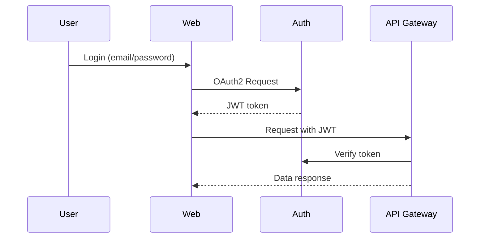

# FinTrust Auth Flow

Optional auth flow used in Security Champions training.

Note: In this training repo, the API does **not** verify the JWT for the `/users/:id` route (deliberate IDOR flaw for training).
